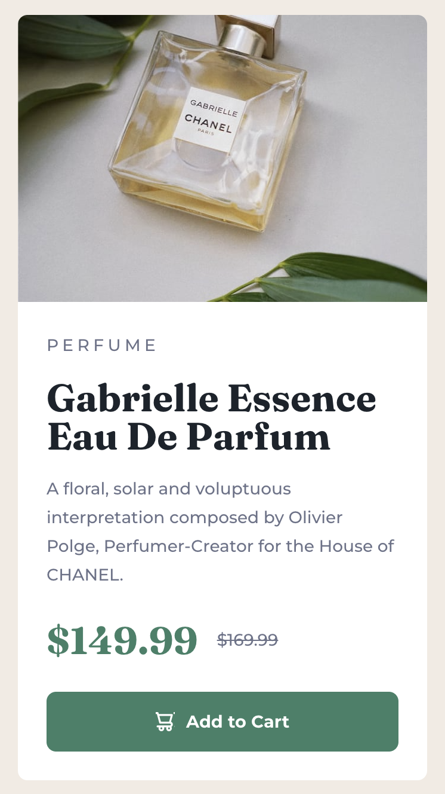

# Frontend Mentor - Product preview card component solution

This is a solution to the [Product preview card component challenge on Frontend Mentor](https://www.frontendmentor.io/challenges/product-preview-card-component-GO7UmttRfa). Frontend Mentor challenges help you improve your coding skills by building realistic projects. 

## Table of contents

- [Overview](#overview)
  - [The challenge](#the-challenge)
  - [Screenshot](#screenshot)
  - [Links](#links)
- [My process](#my-process)
  - [Built with](#built-with)
  - [What I learned](#what-i-learned)

## Overview

### The challenge

Users should be able to:

- View the optimal layout depending on their device's screen size
- See hover and focus states for interactive elements

### Screenshot

### Links

- Solution URL: [Solution URL](https://github.com/Jack-OC/Product-Preview-Card)
- Live Site URL: [Live Site URL](https://jack-oc.github.io/Product-Preview-Card/)

## My process

### Built with

- Semantic HTML5 markup
- CSS custom properties
- Flexbox
- CSS Grid

### What I learned
I found continuing to practcing using HTML CSS with this project useful as I decided to design it mobile view first. It wasn't too difficult, but I initially had a problem equally spacing the perfume image with the information content. While using Flexbox to accomplish this it wasn't spacing equally with image taking up more space on the card. To resolve this issue I decided to use CSS Grid. I split the card content into two columns when the viewport was above 600px as the card wasn't properly visible on the screen. When the viewport is below the 600px the card switches to one column to make the card more legible and have a nicer design. I used srcset to make the project more responsive, by changing the version of the image based on the same 600px breakpoint. This was more efficient than trying to switch between css classes with different background images for the product image div.
